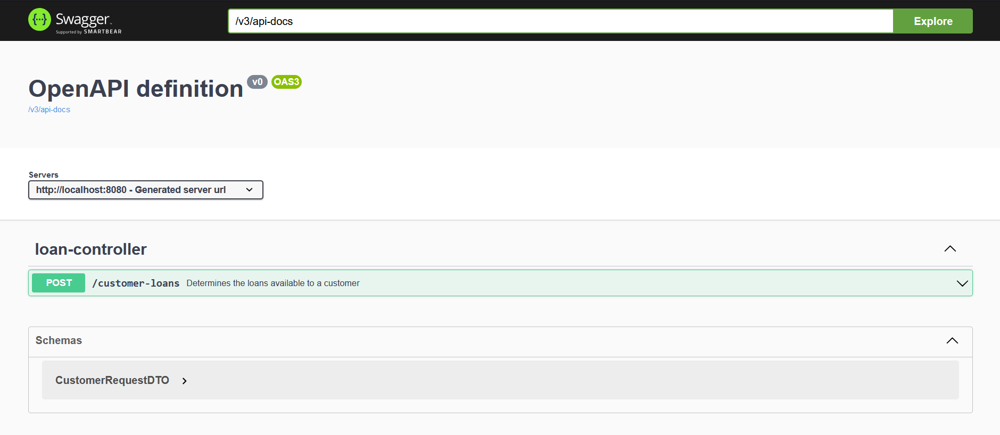

# Loan API

Resolution of the Backend-br Challenge.

You can access the GitHub repository for this project here:
[Loan-challenge](https://github.com/backend-br/desafios/blob/master/loans/PROBLEM.md)

---

This is a REST API for determining which loan types a customer is eligible for based on salary, age, and location.

---

## Architecture Diagram

The project follows a layered architecture pattern, ensuring modularity, etc. The main layers include:

- **Presentation Layer**: Handles HTTP requests and responses, acting as the entry point for the API.
- **Service Layer**: Implements business logic and processes data before passing it between the controller and other layers.
- **Data Transfer Objects (DTOs)**: Defines structured objects to encapsulate data being sent and received.
- **Exception Handling Layer**: Centralized handling of application exceptions to ensure consistent error responses.


---

## Technologies Used

- Java 23
- Spring Boot 3
- Maven
- Lombok
- Swagger (OpenAPI)
- SLF4J (Logging)

---

## Project Structure


---

## API Endpoints

### Loan Controller (`/customer-loans`)

#### **Determine Eligible Loans**
```http
POST /customer-loans
```
**Request Body:**
```json
{
  "age": 28,
  "cpf": "123.456.789-10",
  "name": "Guilherme",
  "income": 4000.00,
  "location": "SP"
}
```
**Responses:**
- `200 OK` - Loans retrieved successfully
- `400 Bad Request` - Invalid request data
- `500 Internal Server Error` - Internal API error

**Example Response:**
```json
{
  "customer": "Guilherme",
  "loans": [
    { "type": "PERSONAL", "interest_rate": 4 },
    { "type": "GUARANTEED", "interest_rate": 3 },
    { "type": "CONSIGNMENT", "interest_rate": 2 }
  ]
}
```

---

## Running the Application

### Prerequisites
Ensure you have the following installed:
- Java 23
- Maven
- Lombok

### Build and Run
```sh
mvn clean install
mvn spring-boot:run
```

The application will start on `http://localhost:8080`.

---

## Swagger Documentation

The API documentation is available at:

`http://localhost:8080/swagger-ui/index.html`

<br>


```

